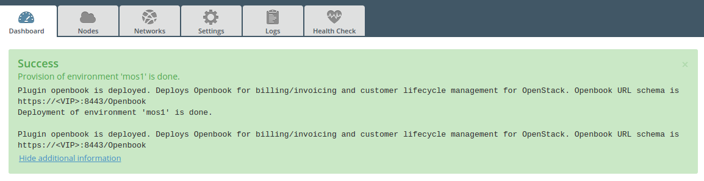

.. _user_guide:

User Guide
==========

.. _plugin_configuration:

Plugin configuration
--------------------

#. `Create a new environment <http://docs.openstack.org/developer/fuel-docs/userdocs/fuel-user-guide/create-environment/start-create-env.html>`_
   with the Fuel UI wizard.  At the moment only the Ubuntu distribution is supported.
   
   .. note:: The *Openbook Plugin* is a *hot-pluggable plugin* which means that it is possible to install and deploy the
             Openbook Plugin in an environment that is already deployed.
   
   .. note:: Please note – the Ceilometer service is not required for all Openbook use cases. Where Ceilometer
             is not available or has been disabled, you still have the ability to bill for service instances such as
             instances, volumes, or floating IPs in intervals of 15 minutes (service instances created and deleted
             within the 15 minute interval will not be billed). In this circumstance, unselect the incremental
             sync, and decrease the interval for the full resync.
             
             With Ceilometer, you have the ability to bill for service instances in intervals of a second or ability
             to bill for metered resources such as network bandwidth, object storage bytes on disk.

#. Click on the Settings tab of the Fuel web UI.

   Select "Other", enable the plugin by clicking on the
   "Openbook Plugin" checkbox and fill-in the required fields (default for 'database password' is Tall!g3nt):

   .. image:: _static/plugin-openbook-config_s.png
      :alt: A screenshot of the Openbook Plugin settings UI for 8.0
      :scale: 90%

   .. note:: The Sharefile Username will be your e-mail and the password will be the one you setup
             when you received the e-mail about your Sharefile account being created. If you do not
             have Sharefile access to Talligent, please contact openbook@talligent.com.

#. Click *Save Settings* at the bottom of the page to save the configuration parameters.

#. Switch to the *Nodes* tab.

#. After `adding all OpenStack nodes/roles <http://docs.openstack.org/developer/fuel-docs/userdocs/fuel-user-guide/configure-environment/add-nodes.html>`_,
   add an Openbook node (optional: rename to something meaningful, such as "openbook"):
   
   .. image:: _static/openbook-node.png
      :alt: A screenshot of the Openbook host name
      :scale: 90%

#. Select the *Networks* tab, select *Connectivity Check*, and `Verify Networks <http://docs.openstack.org/developer/fuel-docs/userdocs/fuel-user-guide/configure-environment/verify-networks.html>`_.

#. Then finally, `Deploy Changes <http://docs.openstack.org/developer/fuel-docs/userdocs/fuel-user-guide/deploy-environment/deploy-changes.html>`_.

.. _plugin_install_verification:

Plugin Install Verification
---------------------------

Once the deployment is finished, the Dashboard tab will display the "Success" notification, stating that
the plugin is deployed and will give the URL schema for accessing the Openbook UI.

Use the fuel command line to retrieve the IP address of the openbook node.

.. _retrieve_ip: 

.. code:: bash

    [root@fuel ~]# fuel nodes
    id | status   | name          | cluster | ip        | [..] | roles             | [..] 
    ---|----------|---------------|---------|-----------|------|-------------------|------
    2  | ready    | compute-01    | 2       | 10.20.0.4 |      | cinder, compute   |      
    1  | ready    | controller-01 | 2       | 10.20.0.3 |      | controller        |      
    3  | ready    | openbook      | 2       | 10.20.0.5 |      | openbook          |      
    .. | .....    | ..............| ...     | ......... |      | ...............   |      

In this example, the Openbook UI would be accessed at ``https://10.20.0.5:8443/Openbook``

The default login for the Openbook UI is:

user: admin

password: Tall!g3nt

Using Openbook
--------------

Official documentation for various features of Openbook can be found below.

* Guide: `Creating a Rate Plan <http://talligent.com/resources/openbook-v3-how-to-guide-creating-a-rate-plan/>`_

* Guide: `Capacity Reports <http://talligent.com/resources11/openbook-v3-guide-capacity-reports/>`_

* Guide: `Extracting Data from Openbook (API) <http://talligent.com/resources/openbook-v3-how-to-guide-extracting-data/>`_

