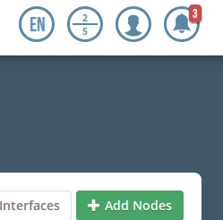
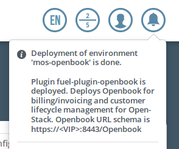

.. _user_guide:

User Guide
==========

.. _plugin_configuration:

Plugin configuration
--------------------

#. `Create a new environment <https://docs.mirantis.com/openstack/fuel/fuel-7.0/user-guide.html#launch-wizard-to-create-new-environment>`_
   with the Fuel UI wizard.  At the moment only the Ubuntu distribution is supported.

   * When stepping through the 'new OpenStack environment' wizard, be sure to enable 
     Ceilometer in the Additonal Services section. Openbook relies on various endpoints 
     for data, one of which is Ceilometer. 
    
     .. image:: _static/ceilometer-select_s.png
        :alt: A screenshot of the Install Ceilometer step
    
#. Click on the Settings tab of the Fuel web UI.

<<<<<<< HEAD
   Select the "Openbook Plugin" tab, enable the plugin by clicking on the
   "Openbook Plugin" checkbox and fill-in the required fields (default for 'database password' is Tall!g3nt):
=======
- Click on the Settings tab of the Fuel web UI.

  For fuel version 7.0: select the "Openbook Plugin" tab, enable
  the plugin by clicking on the “Openbook Plugin” checkbox and
  fill-in the required fields:

  .. image:: _static/plugin-openbook-config_s.png
     :alt: A screenshot of the Openbook Plugin settings UI for 7.0
     :scale: 90%

  For fuel version 6.1: scroll down the page, select the Openbook Plugin
  check-box and fill-in the required fields:

  .. image:: _static/plugin-openbook-config-61.png
     :alt: A screenshot of the Openbook Plugin settings UI for 6.1
     :scale: 90%
>>>>>>> 0c34711... branched off for 6.1; removed all 7.0-related material

   .. image:: _static/plugin-openbook-config_s.png
      :alt: A screenshot of the Openbook Plugin settings UI for 7.0
      :scale: 90%

   .. note:: The Sharefile Username will be your e-mail and the password will be the one you setup
             when you received the e-mail about your Sharefile account being created. If you do not
             have Sharefile access to Talligent, please contact openbook@talligent.com.

#. Click *Save Settings* at the bottom of the page to save the configuration parameters.

#. Switch to the *Nodes* tab.

#. After `adding all OpenStack nodes/roles <https://docs.mirantis.com/openstack/fuel/fuel-7.0/user-guide.html#add-nodes-ug>`_,
   add an Openbook node (optional: rename to something meaningful, such as "openbook"):
   
   .. image:: _static/openbook-node.png
      :alt: A screenshot of the Openbook host name
      :scale: 90%

<<<<<<< HEAD
#. Select the *Networks* tab, scroll to the bottom, and `Verify Networks <https://docs.mirantis.com/openstack/fuel/fuel-7.0/user-guide.html#verify-networks>`_.

#. Then finally, `Deploy Changes <https://docs.mirantis.com/openstack/fuel/fuel-7.0/user-guide.html#deploy-changes>`_.

<<<<<<< HEAD
.. _plugin_install_verification:
=======
- After `adding all OpenStack nodes/roles <https://docs.mirantis.com/openstack/fuel/fuel-6.1/user-guide.html#add-nodes-ug>`_
  , add an Operating System (base-os) node and rename the base-os host as "openbook":
=======
- After `adding all OpenStack nodes/roles <https://docs.mirantis.com/openstack/fuel/fuel-7.0/user-guide.html#add-nodes-ug>`_
  , add a base-os node and rename the base-os host as "openbook":
>>>>>>> 4aa5a60... Revert "branched off for 6.1; removed all 7.0-related material"

  .. image:: _static/openbook-node.png
     :alt: A screenshot of the Openbook host name
     :scale: 90%

- Select the *Networks* tab, scroll to the bottom, and `Verify Networks <https://docs.mirantis.com/openstack/fuel/fuel-7.0/user-guide.html#verify-networks>`_.

<<<<<<< HEAD
- Then finally, `Deploy Changes <https://docs.mirantis.com/openstack/fuel/fuel-6.1/user-guide.html#deploy-changes>`_
>>>>>>> 0c34711... branched off for 6.1; removed all 7.0-related material
=======
- Then finally, `Deploy Changes <https://docs.mirantis.com/openstack/fuel/fuel-7.0/user-guide.html#deploy-changes>`_
>>>>>>> 4aa5a60... Revert "branched off for 6.1; removed all 7.0-related material"

Plugin Install Verification
---------------------------

<<<<<<< HEAD
<<<<<<< HEAD
Once the deployment is finished, the Dashboard tab will display the "Success" notification, stating that
the plugin is deployed and will give the URL schema for accessing the Openbook UI.

.. image:: _static/deployment-success.png
   :alt: A screenshot of the Dashboard Success notification
=======
Once the deployment is finished, a 'Success' notification will display.
=======
Once the deployment is finished, the notification icon will show there to be a new notification message.
>>>>>>> 4aa5a60... Revert "branched off for 6.1; removed all 7.0-related material"

When clicking the notification icon, there will be a message stating that the plugin is deployed and
will give the URL schema for accessing the Openbook UI.

<<<<<<< HEAD
.. image:: _static/deployment-success-full.png
   :alt: A screenshot of the full notification message
>>>>>>> 0c34711... branched off for 6.1; removed all 7.0-related material
=======

>>>>>>> 4aa5a60... Revert "branched off for 6.1; removed all 7.0-related material"
   :scale: 90%

Use the fuel command line to retrieve the IP address of the openbook node.

.. _retrieve-ip: 

.. code:: bash

    [root@fuel ~]# fuel nodes
<<<<<<< HEAD
<<<<<<< HEAD
    id | status   | name          | cluster | ip        | [..] | roles             | [..] 
    ---|----------|---------------|---------|-----------|------|-------------------|------
    2  | ready    | compute-01    | 2       | 10.20.0.4 |      | cinder, compute   |      
    1  | ready    | controller-01 | 2       | 10.20.0.3 |      | controller, mongo |      
    3  | ready    | openbook      | 2       | 10.20.0.5 |      | openbook          |      
    .. | .....    | ..............| ...     | ......... |      | ...............   |      
=======
    id | status   | name           | cluster | ip        | [..] | roles             | [..] 
    ---|----------|----------------|---------|-----------|------|-------------------|------
    2  | ready    | compute-01     | 2       | 10.20.0.4 |      | cinder, compute   |      
    1  | ready    | controller-01  | 2       | 10.20.0.3 |      | controller, mongo |      
    3  | ready    | openbook       | 2       | 10.20.0.5 |      | base-os           |      
    .. | .....    | .............. | ...     | ......... |      | ...............   |      
>>>>>>> 0c34711... branched off for 6.1; removed all 7.0-related material
=======
    id | status   | name             | cluster | ip        | [..] | roles             | [..] 
    ---|----------|------------------|---------|-----------|------|-------------------|------
    2  | ready    | Untitled (84:d2) | 2       | 10.20.0.4 |      | cinder, compute   |      
    1  | ready    | Untitled (54:19) | 2       | 10.20.0.3 |      | controller, mongo |      
    3  | ready    | openbook         | 2       | 10.20.0.5 |      | base-os           |      
    .. | .....    | ................ | ...     | ......... |      | ...............   |      
>>>>>>> 4aa5a60... Revert "branched off for 6.1; removed all 7.0-related material"

In this example, the Openbook UI would be accessed at ``https://10.20.0.5:8443/Openbook``

Using Openbook
--------------

For instructions on using Openbook, please see the `official documentation <https://talligent.sharefile.com/>`_.
