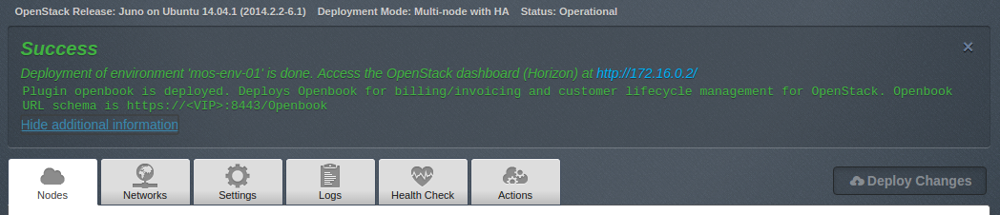

User Guide
==========

Intro
+++++

`Contact Talligent <mailto:openbook@talligent.com>`_ to get access to the 
Talligent Sharefile account for downloading Openbook and the Openbook User Guide.

1. `Create a new environment <https://docs.mirantis.com/openstack/fuel/fuel-6.1/user-guide.html#launch-wizard-to-create-new-environment>`_
   with the Fuel UI wizard.  At the moment only the Ubuntu distribution is supported.

  * When stepping through the 'new OpenStack environment' wizard, be sure to enable 
    Ceilometer in the Additonal Services section. Openbook relies on various endpoints 
    for data, one of which is Ceilometer. 
    
    .. image:: _static/ceilometer-select_s.png
       :alt: A screenshot of the Install Ceilometer step
    
2. Click on the Settings tab of the Fuel web UI.

  Scroll down the page, select the Openbook Plugin check-box and fill-in the required fields:

  .. image:: _static/plugin-openbook-config-61.png
     :alt: A screenshot of the Openbook Plugin settings UI for 6.1
     :scale: 90%

  **NOTE:** The Sharefile Username will be your e-mail and the password will be the one you setup
  when you received the e-mail about your Sharefile account being created. If you do not
  have Sharefile access to Talligent, please contact openbook@talligent.com.

3. Click *Save Settings* at the bottome of the page to save the configuration parameters.

4. Switch to the *Nodes* tab.

5. After `adding all OpenStack nodes/roles <https://docs.mirantis.com/openstack/fuel/fuel-6.1/user-guide.html#add-nodes-ug>`_,
   add an Operating System (base-os) node and rename the base-os host as "openbook":

  .. image:: _static/select-os-openbook.png
     :alt: A screenshot of the Openbook host name
     :scale: 90%

6. Select the *Networks* tab, scroll to the bottom, and `Verify Networks <https://docs.mirantis.com/openstack/fuel/fuel-6.1/user-guide.html#verify-networks>`_.

7. Then finally, `Deploy Changes <https://docs.mirantis.com/openstack/fuel/fuel-6.1/user-guide.html#deploy-changes>`_

Plugin Install Verification
+++++++++++++++++++++++++++

Once the deployment is finished, a 'Success' notification will display.

.. image:: _static/deployment-success.png
   :alt: A screenshot of the notification message
   :scale: 90%

When expanding the success dialog ('Show additional information'), there will be a message stating that the plugin is deployed and
will give the URL schema for accessing the Openbook UI.

Use the fuel command line to retrieve the IP address of the openbook node.

.. code:: bash

    [root@fuel ~]# fuel nodes
    id | status   | name           | cluster | ip        | [..] | roles             | [..] 
    ---|----------|----------------|---------|-----------|------|-------------------|------
    2  | ready    | compute-01     | 2       | 10.20.0.4 |      | cinder, compute   |      
    1  | ready    | controller-01  | 2       | 10.20.0.3 |      | controller, mongo |      
    3  | ready    | openbook       | 2       | 10.20.0.5 |      | base-os           |      
    .. | .....    | .............. | ...     | ......... |      | ...............   |      

In this example, the Openbook UI would be accessed at ``https://10.20.0.5:8443/Openbook``

Using Openbook
++++++++++++++

For instructions on using Openbook, please see the `official documentation <https://talligent.sharefile.com/>`_.
